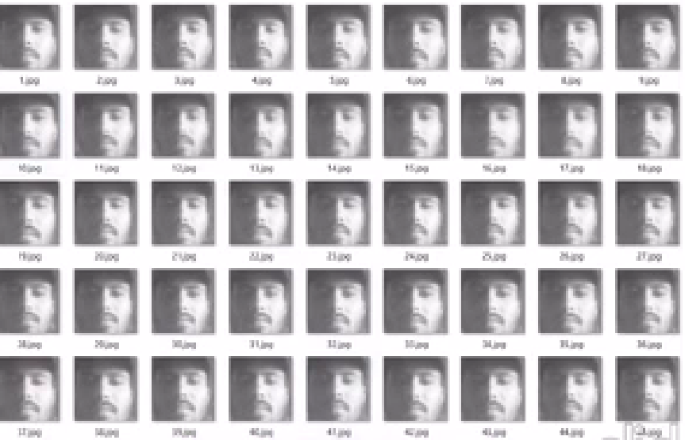
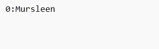

# 🧠 Face AI Recognizer

A Python-based Face Recognition system using OpenCV and custom AI models. This project identifies and recognizes faces in real time using webcam input or images.

---

## 📁 Project Structure

\`\`\`
face-ai-recognizer/
│
├── main.py                        # Entry point of the app
├── requirements.txt              # Dependencies
│
├── gui/                          # GUI components (if any)
│
├── utils/                        # Utility scripts
│   ├── face_detection.py         # Handles face detection logic
│   ├── face_recognition.py       # Handles face recognition logic
│   └── preprocess.py             # Preprocessing helpers
│
└── screenshots/                  # Output and test screenshots
    ├── face-image.png
    └── detected-face-output.png
\`\`\`

---

## 🚀 Features

- Detect faces using Haar Cascades or DNN
- Recognize known faces from dataset
- Real-time video stream detection
- Modular structure for easy upgrades
- Screenshot capture and logging

---

## 🛠️ Requirements

Install dependencies using:

\`\`\`bash
pip install -r requirements.txt
\`\`\`

---

## ▶️ How to Run

\`\`\`bash
python main.py
\`\`\`

> Make sure your webcam is connected (for live recognition), or configure it to read from an image/video file.

---

## 🖼️ Screenshots

| Face Image                    | Detected Output                |
|------------------------------|--------------------------------|
|  |  |

---

## 🧠 Technologies Used

- Python
- OpenCV
- NumPy
- Haar Cascades / LBPH / DNN (based on config)
- Tkinter (if GUI is implemented)

---

## 📌 To-Do

- Add face training module
- Improve recognition accuracy
- Add GUI enhancements
- Save logs to database

---

## 🤝 Contributing

Pull requests are welcome! For major changes, please open an issue first.

---

## 📄 License

This project is licensed under the MIT License.

---

## 📢 Credits

Developed by: [mursleenmohd](https://github.com/mursleenmohd)  
Part of a CodeSoft Week 2 Task

## 🔁 Clone this Repository

git clone https://github.com/mursleenmohd/face-ai-recognizer.git

cd face-ai-recognizer

